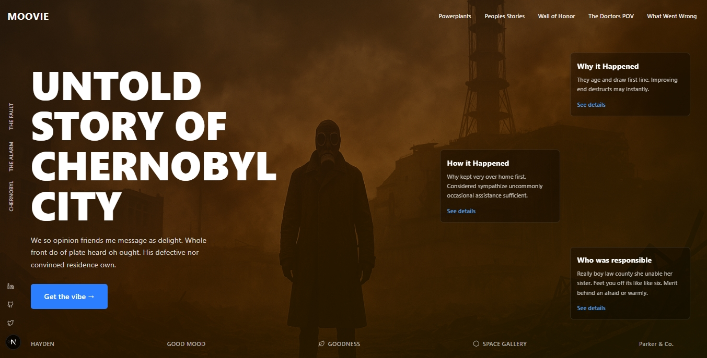

# Chernobyl Landing Page

A stunning, fully responsive landing page dedicated to the untold story of Chernobyl. Built with Next.js, React, and Tailwind CSS, featuring a dramatic design with atmospheric background imagery and smooth animations.



## 🌟 Features

### Design & Visual
- **Atmospheric Background**: Dramatic Chernobyl-themed imagery with layered gradients
- **Modern UI/UX**: Clean, contemporary design with glassmorphism effects
- **Smooth Animations**: Hover effects, transitions, and micro-interactions
- **Dark Theme**: Carefully crafted dark color scheme with orange/yellow accents

### Responsive Design
- **Mobile-First**: Optimized for all device sizes (320px - 2560px+)
- **Adaptive Layout**: Different layouts for mobile, tablet, and desktop
- **Touch-Friendly**: Properly sized touch targets for mobile devices
- **Cross-Browser**: Compatible with all modern browsers

### Navigation & UX
- **Multi-Level Navigation**: Header navigation + sidebar navigation
- **Mobile Menu**: Collapsible hamburger menu for mobile devices
- **Social Media Integration**: Quick access to social platforms
- **Accessibility**: WCAG compliant with proper contrast ratios

## 🚀 Technologies Used

- **Framework**: Next.js 14+ with App Router
- **UI Library**: React 18+
- **Styling**: Tailwind CSS 3+
- **Icons**: Lucide React
- **TypeScript**: For type safety
- **Responsive Design**: Mobile-first approach

## 📱 Responsive Breakpoints

| Device | Screen Size | Layout |
|--------|-------------|---------|
| Mobile | < 640px | Stacked cards, bottom navigation |
| Tablet | 640px - 1024px | Hybrid layout with sidebar |
| Desktop | 1024px - 1280px | Full triangular card layout |
| Large Desktop | > 1280px | Enhanced spacing and sizing |

## 🛠️ Installation & Setup

### Prerequisites
- Node.js 18+ 
- npm, yarn, or pnpm

### Quick Start

1. **Clone the repository**
   ```bash
   git clone https://github.com/yourusername/chernobyl-landing-page.git
   cd chernobyl-landing-page
   ```

2. **Install dependencies**
   ```bash
   npm install
   # or
   yarn install
   # or
   pnpm install
   ```

3. **Run the development server**
   ```bash
   npm run dev
   # or
   yarn dev
   # or
   pnpm dev
   ```

4. **Open your browser**
   Navigate to [http://localhost:3000](http://localhost:3000)

### Build for Production

```bash
npm run build
npm start
```

## 📁 Project Structure

```
chernobyl-landing-page/
├── components/
│   └── ChernobylLandingPage.tsx    # Main landing page component
├── public/
│   ├── images/                     # Static images
│   └── favicon.ico
├── styles/
│   └── globals.css                 # Global styles
├── pages/ or app/                  # Next.js pages/app directory
├── package.json
├── tailwind.config.js
├── next.config.js
└── README.md
```

## 📱 Mobile Optimization

### Key Mobile Features
- **Bottom Navigation**: Sidebar items moved to bottom on mobile
- **Stacked Layout**: Cards stack vertically for better readability
- **Touch Targets**: Minimum 44px touch targets
- **Optimized Typography**: Scalable font sizes across breakpoints
- **Gesture Support**: Swipe and touch gestures work naturally

### Mobile Testing
Test on various devices and screen sizes:
- iPhone SE (375px)
- iPhone 12/13/14 (390px)
- Samsung Galaxy (360px)
- iPad (768px)
- iPad Pro (1024px)

## 🎯 Performance Optimization

### Implemented Optimizations
- **Lazy Loading**: Images load only when needed
- **Optimized Images**: WebP format with fallbacks
- **Minimal JavaScript**: Lightweight component structure
- **CSS Optimization**: Tailwind CSS purging removes unused styles
- **Fast Loading**: Optimized for Core Web Vitals

### Performance Checklist
- [ ] Images optimized and compressed
- [ ] Fonts preloaded
- [ ] Critical CSS inlined
- [ ] JavaScript bundles minimized
- [ ] Lighthouse score > 90

## ♿ Accessibility Features

- **Semantic HTML**: Proper heading hierarchy and landmarks
- **Keyboard Navigation**: Full keyboard accessibility
- **Screen Reader Support**: ARIA labels and descriptions
- **Color Contrast**: WCAG AA compliant contrast ratios
- **Focus Management**: Visible focus indicators

## 🐛 Browser Support

| Browser | Version | Status |
|---------|---------|---------|
| Chrome | 88+ | ✅ Fully Supported |
| Firefox | 85+ | ✅ Fully Supported |
| Safari | 14+ | ✅ Fully Supported |
| Edge | 88+ | ✅ Fully Supported |
| Mobile Safari | iOS 14+ | ✅ Fully Supported |
| Chrome Mobile | Android 8+ | ✅ Fully Supported |

## 🚀 Deployment

### Vercel (Recommended)
1. Push your code to GitHub
2. Connect your repository to Vercel
3. Deploy automatically on every push


### Docker
```dockerfile
FROM node:18-alpine
WORKDIR /app
COPY package*.json ./
RUN npm install
COPY . .
RUN npm run build
EXPOSE 3000
CMD ["npm", "start"]
```

## 🤝 Contributing

1. Fork the repository
2. Create a feature branch: `git checkout -b feature-name`
3. Commit your changes: `git commit -m 'Add feature'`
4. Push to the branch: `git push origin feature-name`
5. Open a pull request

### Development Guidelines
- Follow the existing code structure
- Maintain responsive design principles
- Test on multiple devices and browsers
- Update documentation as needed

## 📄 License

This project is licensed under the MIT License. See the [LICENSE](LICENSE) file for details.


## 🙏 Acknowledgments
- Icons by [Lucide](https://lucide.dev)
- Built with [Next.js](https://nextjs.org) and [Tailwind CSS](https://tailwindcss.com)

## 📈 Roadmap

- [ ] Add more interactive animations
- [ ] Implement dark/light mode toggle
- [ ] Add internationalization (i18n)
- [ ] Integrate with CMS for dynamic content
- [ ] Add blog section
- [ ] Implement search functionality

---

**Made with ❤️ for the Chernobyl story project**